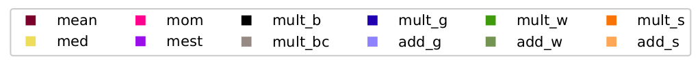
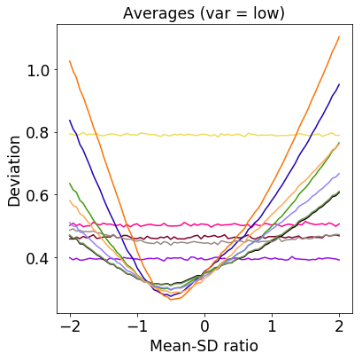

# 1dim: estimators using smoothed random perturbations

In this repository, we provide example code which gives the complete implementation of the numerical experiments carried out the following papers:

 - PAC-Bayes under heavy tails (<a href="https://papers.nips.cc/paper/8539-pac-bayes-under-potentially-heavy-tails">NeurIPS 2019</a>, <a href="https://github.com/feedbackward/1dim/blob/master/poster_A0.pdf">Poster</a>).
 - Distribution-robust mean estimation via smoothed random perturbations (<a href="https://arxiv.org/abs/1906.10300">arXiv</a>).

__Author and maintainer:__<br>
<a href="https://feedbackward.com/">Matthew J. Holland</a> (Osaka University, ISIR)


## Overview

In this set of experiments, we carry out a series of empirical tests of the performance of different robust mean estimators on the real line, under weak assumptions on the underlying data, namely that the variance is finite. In particular, here we consider a set of experiments where in addition to the underlying distribution and sample size, we also tightly control the ratio of the mean to the standard deviation.

The basic contents of this repository (within the `1dim` sub-directory) are as follows:

- `bounds.py`: Computation of high-probability deviation bounds for each method.
- `config.py`: Configuration file for experiment/method parameters.
- `data.py`: Routines for generating the randomized data as specified in the configuration file.
- `demo.ipynb`: After running the experiments, this Jupyter notebook includes scripts for generating figures based on the saved performance results.
- `helpers.py`: A handful of functions for both clerical and statistical tasks.
- `main.py`: Script for running all the experiments. Current setup uses `multiprocessing` module to run experiments for multiple methods in parallel, whenever possible.
- `methods.py`: Core implementation of all the estimators being tested.


## Setup

This demo has been tested using Python 3.6 and NumPy 1.16, using the following virtual environment managed using `conda` (of course, `conda` is by no means required). Assuming the user has `conda` installed run
```
$ conda update -n base conda
$ conda create -n 1dim python=3.6 scipy jupyter matplotlib
```
to prepare the necessary software.

All experimental parameters are controlled in `config.py`, and can be tweaked freely. Some basic points are as follows:

- Range of mean-SD ratio to be tested: `_ratios`.
- "Variance levels" in the paper: controlled by `_sd` and `_sdlog`.
- Sample sizes to be tested: `_nvals`.


## Running the demo

Once configuration settings are to your liking (or left as defaults), execute the following commands to run the full set of experiments as prescribed.
```
$ conda activate 1dim
(1dim) $ python main.py
```
The raw results (before averaging, can be rather large) will be stored in `results`. The interactive code in this notebook also uses `config.py`, and assumes that results are present for all methods specified in the configuration file.

 <br>
 

The above figure is an example of the results that can be generated using the demo notebook.
